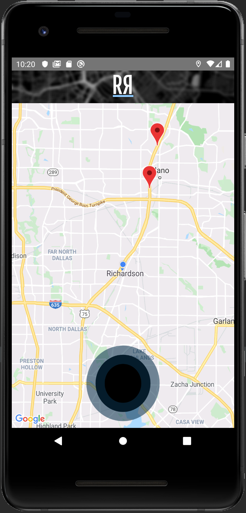

# Road Ranger: Master the Road!

Created using React Native, this Android/IOS app makes travel better by letting users create custom map markers via voice/text or a lean button-based UI, and then share them with other users, receiving updates via text to voice. Created with React Native, MongoDB, Node/Express, and community libraries this app represents the culmination of knowldge and skills gained at the SMU Coding Bootcamp. 

# Project Features
1. [Overview](#Overview)
2. [See It In Action](#Demo-Gifs)
3. [Technology Used](#Technology-Used)
4. [Challenges](#Challenges)
5. [Final Thoughts](#Final-Thoughts)

# Overview

## Adding a Marker 

This app is designed to help users navigate the dynamic world of the road. Creating a new marker is easy, and contolled by a simple UI: Users can create custom markers by pressing and holding the central button, and then speaking their message into their phone. For those who prefer not to use voice recognition, tapping the button will bring up a modal with several buttons describing common road conditions, each of which can add a marker on a single tap. For those with a more complex message, there is an input box to type up a custom message. 

## Always Aware Of the Road

Once added, a marker will appear on the map for all other users of Road Ranger. Further, when a driver using our app gets within half a mile of a marker, text to voice software will inform them of the situation. To make sure that users never miss a marker, markers are retrieved from the database every half mile, providing full coverage with minimal api calls. You can check out the back end code for this React Native app [here](https://github.com/Nick-Haer/roadRangerBackend).

## Demo-Gifs

### To add a marker, simply tap the button that describes the road situation.

### It's easy to add a custom marker too.

## Technology-Used

* [React-Native](https://facebook.github.io/react-native/)
* [React-Vector-Icons](https://github.com/oblador/react-native-vector-icons)
* [React-Native-Maps](https://github.com/react-native-community/react-native-maps)
* [Google-Maps-API](https://developers.google.com/maps/documentation/?_ga=2.187019944.-1474704009.1568742778&_gac=1.229229294.1574740445.CjwKCAiAlO7uBRANEiwA_vXQ-_zyoNwzJ7qzuFRqLLAKIlarUTxEfofwA9eu1Co6nBSGkqhmH_8TGBoCgX0QAvD_BwE)
* [Haversine](https://www.npmjs.com/package/haversine)
* [React-Navigation](https://reactnavigation.org/)
* [Axios](https://www.npmjs.com/package/axios)
* [React-Native-Voice](https://github.com/react-native-community/react-native-voice)
* [Text-To-Speech](https://www.npmjs.com/package/react-native-tts)

### Backend
* [Mongoose](https://mongoosejs.com/)
* [MongoDB](https://docs.mongodb.com/)
* [Node](https://nodejs.org/en/)

## Challenges

From the outset, we intended for this project to be a challenge, and were not dissapointed. At first, getting android studio setup and running smoothly with React-Native was difficult. After mastering this, we tackled the difficulties in getting several react-native community made libraries to work together seamlessly, both with each together and with our logic. This eventually proved our greatest challenge, requiring us to understand in detail the inner workings of the libraries we had chosen to provide our functionality, and how they would interface with our code in a wide arrange of cases. Ultimately, this difficult project proved the most rewarding, necessitating long hours of research and debugging, but opening up new and exciting platforms for development.

## Final-Thoughts

This project presents several intriguing potential routes for expansion, including adding user profiles, and adding more selectivity choices for how users utilize Road Ranger: ie, if they would like to hear only certain kinds of alerts.
